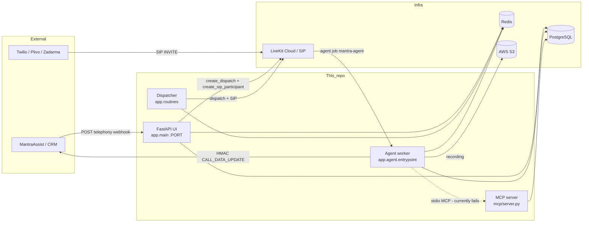
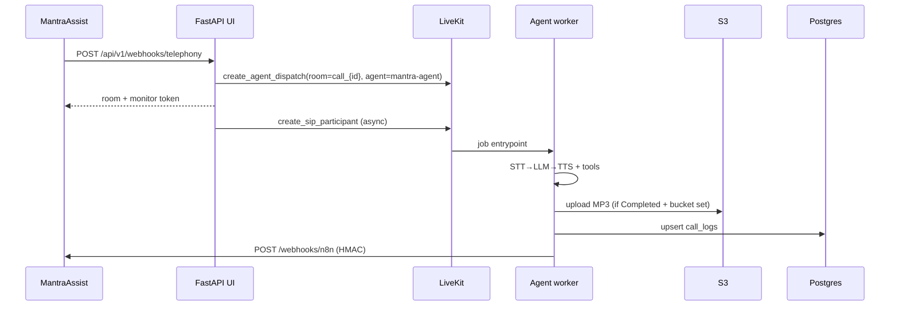
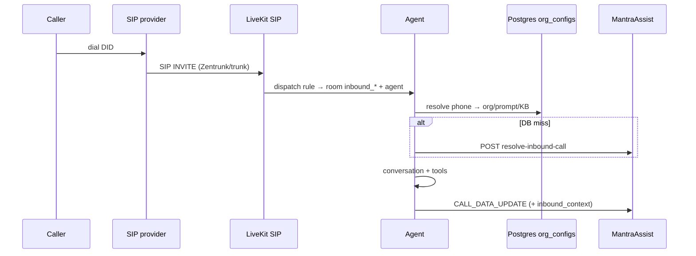

# Mantra Voice Agent — Project Reference (SSOT)

> **Canonical developer documentation** for this repository.  
> Prefer this file over vault notes or README when they conflict with **current code under `app/`**.  
> **Package:** `livekit-agent` · **Version:** `0.1.0` · **Branch context:** `feature/restructure` (2026-07-25)  
> **Verification:** see [`report.md`](report.md) — verdict **GO WITH CAVEATS**

---

## 1. Title & purpose

**Mantra Voice Agent** is a production-oriented, low-latency **bilingual (English/Hindi)** voice AI platform for **telephony**. It connects SIP carriers (Twilio, Plivo, Zadarma) to **LiveKit** rooms, runs a real-time **STT → LLM → TTS** agent (`agent_name=mantra-agent`), manages org-scoped knowledge via PostgreSQL full-text search, and returns post-call artifacts (transcript, summary, recording URL) to the **MantraAssist** backend via HMAC-signed webhooks.

This is **not** a generic chatbot demo: the primary interface is a phone call. The FastAPI UI server exists to receive telephony webhooks, manage SIP/dispatch rules, serve a dashboard/console, and expose KB/org APIs.

---

## 2. Audience & how to use this doc

| Reader | Start here |
|--------|------------|
| New engineer | §§3–7, then §15 Local development |
| On-call / ops | §§14–15, §17 Deployment, §19 Observability, §20 Known issues |
| Backend integrating telephony | §§9–10 (flows + HTTP API) |
| Agent / prompt work | §§11–12, `prompts/` |
| KB / data | §§9 (KB flow), §13 |

**Rules of evidence**

1. Code under `app/` is authoritative after the 2026-07 restructure (`mantra/` removed).
2. Vault pages in `obsidian/` are useful detail and history; they can lag. This file should be updated when behavior changes.
3. Secrets live in `.env` / `.env.local` (not committed). This doc lists **setting names**, not values.

---

## 3. Product overview & use cases

| Use case | What happens |
|----------|----------------|
| **Outbound care / follow-up call** | MantraAssist (or test client) POSTs to `/api/v1/webhooks/telephony` → LiveKit agent dispatch + SIP dial-out → conversation → finalize webhook |
| **Inbound call** | Caller dials DID → provider SIP → LiveKit inbound trunk + dispatch rule → agent job with `direction=inbound` → resolve org/KB/prompt → conversation → finalize |
| **Knowledge-grounded answers** | Agent tool `search_knowledge_base` queries `kb_pages` (FTS) scoped by `kb_id` / tags |
| **Human handoff** | Tool `transfer_to_human` dials a human SIP participant into the **same room**, then silences the AI |
| **Dashboard ops** | Login → JWT → metrics, call history, active calls SSE |
| **KB management** | Dashboard/API ingest (file/text/URL), search, delete |
| **SIP provisioning** | CRUD outbound/inbound trunks + dispatch rules; end-to-end inbound setup for a number |
| **Manual / test dispatch** | `/dispatch-test` and `/api/v1/test/inbound-call` without full CRM payload |

---

## 4. High-level architecture

### 4.1 Processes (must run in prod)

| Process | How to start | Role |
|---------|--------------|------|
| **UI / API server** | `uv run python -m app.main` · scripts `mantra-ui` / `app-ui` · Docker `ui` | FastAPI: webhooks, SIP, dashboard, KB, static |
| **Agent worker** | `uv run python -m app.agent.entrypoint {dev\|start}` · `mantra-agent` / `app-agent` · Docker `agent` | LiveKit agent jobs; STT/LLM/TTS; tools; finalize |
| **Dispatcher / routines** | `uv run python -m app.routines` · `app-dispatcher` · Docker `dispatcher` | Polls Redis `queue:pending`, capacity, zombie cleanup |
| **MCP server** (optional / currently broken from agent) | `uv run python mcp/server.py` · Docker `mcp` | Stdio MCP tools over Postgres |

Local convenience: `./dev.sh` starts MCP + agent (dev) + UI + dispatcher.

### 4.2 System diagram



### 4.3 Outbound call flow (current code)

> **Important (code vs older vault diagrams):**  
> `POST /api/v1/webhooks/telephony` in `app/routers/webhooks.py` **does not enqueue** Redis `queue:pending`. It **immediately** creates an agent dispatch and fires SIP dial-out in a background task.  
> The dispatcher still pops `queue:pending`, but **no producer in `app/` currently calls `redis_service.push_pending()`**. Treat the queue path as infrastructure retained for capacity-gated batching / future use (or external enqueue), not the live telephony webhook path.



### 4.4 Inbound call flow



---

## 5. Tech stack

| Layer | Choice | Notes |
|-------|--------|-------|
| Language | Python ≥3.11 (Docker 3.12) | `uv` for deps (`pyproject.toml` / `uv.lock`) |
| HTTP | FastAPI + Uvicorn | `app/main.py` |
| Realtime | LiveKit Agents ~1.4 | `AgentServer`, `agent_name=mantra-agent` |
| STT | Deepgram Nova-3 | `language=hi` multilingual in `app/agent/pipeline.py` |
| LLM | OpenAI GPT-4o-mini (default); Gemini; DeepSeek | Selected via metadata `model` / `ai_payload.ai_model` |
| TTS | Cartesia Sonic-3 via **LiveKit Inference** | `inference.TTS(model="cartesia/sonic-3")` |
| VAD / turns | Silero VAD + multilingual turn detector | LiveKit plugins |
| Queue / capacity | Redis | Sorted set + hash (see §13) |
| DB | PostgreSQL + **FTS (`tsvector`)** | Not production vector search today |
| Object storage | AWS S3 (boto3) | Recordings + optional KB file copies |
| Auth | JWT (HS256) + SHA-256 hashed admin creds | Dashboard only |
| Metrics | `prometheus-fastapi-instrumentator` | Exposes `/metrics` |
| MCP | `mcp[cli]` + FastMCP | Postgres tools; agent wiring broken (see §20) |
| Frontend | Static HTML/JS under `static/` | No React SPA |

**LiveKit Cloud project** (from `livekit.toml`): subdomain `mantraassist-0ek43ife`; production scaling min/max replicas 1–2.

---

## 6. Repository structure

```
livekit/
├── PROJECT.md                 # ← THIS FILE (SSOT)
├── README.md                  # Short entry point
├── report.md                  # Latest restructure verification
├── AGENTS.md                  # Cursor/agent vault workflow
├── pyproject.toml             # Package + console scripts
├── uv.lock
├── Dockerfile                 # Multi-stage; entrypoint agent|ui|dispatcher|mcp
├── entrypoint.sh
├── dev.sh                     # Local: MCP + agent + UI + dispatcher
├── livekit.toml               # LiveKit Cloud agent deployment config
├── app/                       # ★ Production Python package
│   ├── main.py                # FastAPI factory + lifespan
│   ├── middleware.py          # Logging, Prometheus, crash email handler
│   ├── config/                # Settings, constants, prompt loader, logging
│   ├── models/                # Pydantic schemas
│   ├── routers/               # HTTP routes
│   ├── services/              # LiveKit, Redis, DB, auth, SIP, S3, webhooks, org
│   ├── agent/                 # Entrypoint, pipeline, tools, finalize, safety
│   ├── dispatcher/            # Capacity + single-call dispatch worker
│   ├── routines/              # Dispatcher loop + zombie cleanup CLI
│   ├── kb/                    # Engine, chunker, retriever, ingestion
│   ├── llm/ · stt/ · tts/     # Helpers / provider wrappers (pipeline is primary)
│   ├── recording/             # In-memory SessionRecorder
│   ├── alerter/               # SMTP crash emails
│   └── static/                # Copy of UI assets (served path is repo-root static/)
├── static/                    # ★ Served by FastAPI at /static and page routes
├── prompts/                   # Markdown prompts (system, handoff, analysis, …)
├── config/                    # inbound_mappings.json, voices.json
├── migrations/                # *.sql schema (kb_pages, call_logs, org_configs)
├── scripts/                   # migrate_kb_pages.py, migrate_org_configs.py
├── mcp/server.py              # MCP Postgres tools
├── tests/                     # pytest
├── docs/                      # inbound.md, inbound-testing.md
└── obsidian/                  # Team knowledge vault (links here; not duplicate SSOT)
```

**Removed:** legacy `mantra/` package (Phase 8 cutover).

**Console scripts** (`pyproject.toml`):

| Script | Target |
|--------|--------|
| `mantra-agent` / `app-agent` | `app.agent.entrypoint:run_agent` |
| `mantra-ui` / `app-ui` | `app.main:main` |
| `app-dispatcher` | `app.routines.__main__:main` |

---

## 7. Runtime components

### 7.1 UI server (`app.main`)

- Loads `.env` then `.env.local` (override).
- Lifespan starts: LiveKit clients, Redis, Postgres pool, S3 (non-fatal if S3 fails).
- Serves OpenAPI at `/openapi.json`, health at `/health`, Prometheus at `/metrics`.
- Static files: repo-root `static/` mounted at `/static` (not `app/static/` — that is a copy).
- Default port: `PORT` env or **8081**.

### 7.2 Agent worker (`app.agent.entrypoint`)

- `AgentServer(num_idle_processes=settings.AGENT_MAX_WORKERS)`.
- Registers `@server.rtc_session(agent_name="mantra-agent")`.
- Modes: `dev` (local hot reload via LiveKit CLI) vs `start` (production worker).
- Dockerfile pre-runs `download-files` for models.
- Suppresses OTEL exporters by default; clears HTTP(S)_PROXY in-process.

### 7.3 Dispatcher (`app.routines`)

- Loop every **0.5s**: capacity check → `ZPOPMIN queue:pending` → `dispatch_call` → active hash.
- Zombie cleanup every **60s**: active Redis rooms vs LiveKit `list_rooms`.
- See §4.3: webhook path currently bypasses this queue.

### 7.4 MCP (`mcp/server.py`)

- FastMCP stdio server with many Postgres tools (`list_tables`, `describe_table`, `call_logs`, etc.).
- Agent tries `livekit.agents.llm.mcp.CstdioServerParameters` — **attribute missing** in current LiveKit agents API → caught; agent continues with 3 native tools only.
- Note: MCP file defaults `POSTGRES_PORT=5433` / `POSTGRES_DB=main_db` if env unset — **different** from `app.config.settings` defaults (`5432` / `livekit`). Always set env explicitly.

### 7.5 How they communicate

| From → To | Mechanism |
|-----------|-----------|
| UI → LiveKit | `livekit-api` (direct + Plivo-proxied session) |
| UI → Redis | Capacity dashboards, SIP trunk phone mappings, SIP error status |
| LiveKit → Agent | Job assignment to registered worker |
| Agent → Postgres | asyncpg (KB, org_configs, call_logs) |
| Agent → MantraAssist | HTTPS HMAC webhook |
| Agent → S3 | boto3 upload |
| Dispatcher → LiveKit | Same API helpers as UI |

---

## 8. Core domain concepts

| Concept | Meaning |
|---------|---------|
| **Room** | LiveKit room; outbound `call_{call_id}`, tests `test_{call_id}` / `test_inbound_{…}`, inbound often `inbound_*` prefix from dispatch rules |
| **Agent job** | LiveKit Agents job for `mantra-agent` with JSON **metadata** (CRM payload) |
| **Participant** | SIP caller, AI local participant, optional human transfer SIP participant, optional monitor (subscribe-only token) |
| **SIP trunk** | LiveKit outbound/inbound trunk ID (`ST_…`); provider inferred from trunk address |
| **Dispatch rule** | Maps inbound trunk → room creation + agent dispatch + metadata |
| **Org config** | Row in `org_configs`: phone → org_id, prompt, voice, model, kb_tags, transfer numbers, trunk/rule IDs |
| **KB page / chunk** | Row in `kb_pages` under `kb_id` (often = `org_id`); FTS indexed |
| **Call log** | `call_logs` row + Redis status + post-call webhook payload |
| **Tools** | LLM function tools: `end_call`, `search_knowledge_base`, `transfer_to_human` (+ MCP if wired) |
| **Capacity** | `min(MAX_CONCURRENCY, LIVEKIT_MAX_ROOMS, AGENT_MAX_WORKERS)` vs Redis `calls:active` length |

---

## 9. End-to-end flows (detailed)

### 9.1 Inbound call

1. **Provision** (once): `POST /api/v1/sip/inbound/setup` with `number`, `org_id`, prompt/voice/model/provider → creates/reuses LiveKit inbound trunk + dispatch rule, updates provider forwarding (Plivo Zentrunk path preferred), upserts `org_configs`.
2. Caller dials DID → provider → LiveKit SIP domain.
3. Dispatch rule creates room and dispatches `mantra-agent` with metadata including `direction` / phone (normalized to `phone_number` where applicable).
4. Agent `entrypoint`:
   - Parses metadata; if inbound, `resolve_inbound_context(phone)`:
     - If `LOCAL_INBOUND_MAPPINGS=true` → local JSON only (see §20 path caveat).
     - Else Postgres `org_configs` first, then MantraAssist `POST {BACKEND}/api/v1/telephony/resolve-inbound-call`.
     - If unresolved → **disconnect** (reject call).
   - Registers call in Redis `calls:active` (rejects if at capacity).
   - Builds instructions, STT/LLM/TTS session, tools.
5. Waits for remote participant (60s timeout) → greeting → conversation.
6. On disconnect: `finalize_call` (recording, analysis, DB, webhook, free Redis).

### 9.2 Outbound / telephony webhook dispatch

1. `POST /api/v1/webhooks/telephony` with at least `client_phone` (+ country code) and trunk (`trunk_id` / `call_from_id` / env `SIP_TRUNK_ID`).
2. Resolve `call_id`, `room_name=call_{call_id}`, E.164 phone, provider from trunk.
3. `create_agent_dispatch(room, payload)`.
4. Background: `create_sip_participant(..., wait_until_answered=True)` (Plivo uses proxied LiveKit client when configured).
5. On SIP failure: `sip_service.handle_sip_failure` writes Redis error status for finalize.
6. Response includes monitor JWT (subscribe-only) + LiveKit URL.

### 9.3 Agent conversation + tools

| Tool | Behavior |
|------|----------|
| `search_knowledge_base` | FTS via `KnowledgeRetriever` / `kb_engine.search`, scoped by session `kb_ids` / `kb_tags`; optional `specific_tag` |
| `transfer_to_human` | Resolve department number from metadata/`TRANSFER_NUMBERS` → SIP dial into room → handoff webhook → silence AI instructions |
| `end_call` | Graceful end + room delete |

**Guardrails / safety nets** (`app/agent/safety.py`):

- Inactivity: prompt ~5s, disconnect ~10s while listening/idle.
- Call duration limiter (settings / constants; default **180s**).
- Farewell phrase safety net (hardcoded `FAREWELL_PHRASES`).

### 9.4 Post-call analysis / webhooks / recording

Implemented in `app/agent/finalize.py`:

1. Determine status: Redis `sip_error_status:{id}` or heuristics (Busy / No Answer / Completed).
2. Stop `SessionRecorder`; if **Completed**, combine to MP3 → S3 `recordings/{call_id}.mp3` (skipped if bucket unset).
3. Build transcript; LLM analysis for summary / stage / next_call_on (skipped for failed statuses).
4. Build `CALL_DATA_UPDATE` payload; for inbound add `inbound_context`.
5. Upsert `call_logs`.
6. HMAC POST to `{MANTRAASSIST_BACKEND_URL}/webhooks/n8n`.
7. `HDEL calls:active`, set `calls:status:{id}=completed`.

Sign string: `{body}.{timestamp}` → header `x-signature` (SHA-256 HMAC). Also sends `x-timestamp`, `x-source: n8n`.

### 9.5 KB ingest & retrieval

**Ingest paths**

- Form API: `POST /api/v1/kb/ingest` (file and/or text, `org_id`, tags, optional S3 copy).
- Dashboard-style: `POST /api/v1/knowledge/{upload,text,url}`, list/delete.
- Chunking: `app/kb/chunker.py` + `ingestion.py` → rows in `kb_pages`.

**Retrieval**

- PostgreSQL `websearch_to_tsquery('simple', …)` + `ts_rank` on `text_search` / equivalent.
- Optional tag filter on `page_meta.tags_name`.
- Agent uses function-tool RAG (not upfront full-KB prompt injection).

> README still mentions pgvector + embeddings. **Current schema/code use FTS only.** Vector search is a TODO (`obsidian/Development/TODO.md`).

### 9.6 Dashboard auth & metrics

1. `POST /api/v1/auth/login` with username/password → SHA-256 hashes compared to `ADMIN_*_HASH` → JWT (`JWT_SECRET`, 24h).
2. Dashboard APIs require `Authorization: Bearer <token>` or `?token=`.
3. Metrics from Postgres call aggregates; active/pending from Redis; SSE `/stream` every 2s.
4. HTML pages themselves are **not** JWT-gated at the server (client JS must attach token for API calls).

---

## 10. HTTP API reference

Auth column: **JWT** = dashboard `require_auth`; **None** = no auth in code (treat as internal/network-restricted).

| Method | Path | Auth | Purpose |
|--------|------|------|---------|
| GET | `/health` | None | Liveness `{status, service: ui_server}` |
| GET | `/metrics` | None | Prometheus metrics |
| GET | `/openapi.json` | None | OpenAPI schema (~55 paths) |
| GET | `/` | None | Login page (`static/login.html`) |
| GET | `/dashboard` | None | Dashboard HTML |
| GET | `/console` | None | Test console HTML |
| GET | `/network` | None | Network page |
| GET | `/kb-chat` | None | KB chat UI |
| GET | `/config` | None | `{ url: LIVEKIT_URL }` for frontend |
| GET | `/static/*` | None | Static assets |
| POST | `/api/v1/auth/login` | None | Issue JWT |
| GET | `/api/v1/dashboard/metrics` | JWT | Call aggregates + answer_rate |
| GET | `/api/v1/dashboard/calls` | JWT | Paginated history (`limit`, `offset`) |
| GET | `/api/v1/dashboard/active-calls` | JWT | Redis active map |
| GET | `/api/v1/dashboard/stream` | JWT | SSE capacity/active feed |
| POST | `/api/v1/webhooks/telephony` | None | Outbound dispatch + SIP |
| POST | `/dispatch-test` | None | Agent-only test room + token |
| POST | `/api/v1/test/inbound-call` | None | Test inbound-style SIP + dispatch |
| POST | `/api/v1/sip/trunks/inbound` | None | Create inbound trunk |
| GET | `/api/v1/sip/trunks/inbound` | None | List inbound trunks |
| DELETE | `/api/v1/sip/trunks/inbound/{trunk_id}` | None | Delete inbound trunk |
| PATCH | `/api/v1/sip/trunks/inbound/{trunk_id}` | None | Update inbound trunk |
| POST | `/api/v1/sip/dispatch-rules` | None | Create dispatch rule |
| GET | `/api/v1/sip/dispatch-rules` | None | List rules |
| DELETE | `/api/v1/sip/dispatch-rules/{rule_id}` | None | Delete rule |
| PATCH | `/api/v1/sip/dispatch-rules/{rule_id}` | None | Update rule |
| GET/POST | `/api/v1/sip/plivo-xml` | None | Legacy hangup XML (deprecated path still present) |
| GET/POST | `/api/v1/sip/twilio-webhook` | None | Reject/hangup TwiML helper |
| POST | `/api/v1/sip/plivo-dial-status` | None | Dial status callback (legacy) |
| POST | `/api/v1/sip/inbound/setup` | None | End-to-end inbound number setup |
| POST | `/api/v1/sip/trunks/outbound` | None | Generic outbound trunk create |
| POST | `/api/v1/sip/trunks/outbound/zadarma` | None | Zadarma outbound trunk |
| POST | `/api/v1/sip/trunks/outbound/twilio` | None | Twilio outbound trunk |
| POST | `/api/v1/sip/trunks/outbound/plivo` | None | Plivo outbound trunk |
| GET | `/api/v1/sip/trunks/outbound` | None | List outbound trunks |
| DELETE | `/api/v1/sip/trunks/outbound/{trunk_id}` | None | Delete outbound trunk |
| POST | `/api/v1/kb/chat` | None | KB-augmented chat (OpenAI) |
| POST | `/api/v1/kb/search` | None | FTS search |
| POST | `/api/v1/kb/ingest` | None | Multipart ingest |
| DELETE | `/api/v1/kb/document` | None | Delete by org_id + document_id |
| POST | `/api/v1/knowledge/upload` | None | File ingest by kb_id |
| POST | `/api/v1/knowledge/text` | None | Text ingest |
| POST | `/api/v1/knowledge/url` | None | URL fetch + ingest |
| GET | `/api/v1/knowledge/list` | None | List kb_ids |
| DELETE | `/api/v1/knowledge/{page_id}` | None | Delete page |
| DELETE | `/api/v1/knowledge/by-kb/{kb_id}` | None | Delete all pages for kb |
| GET | `/api/v1/org-configs` | None | List (`?org_id=`) |
| GET | `/api/v1/org-configs/{phone_number}` | None | Get one |
| PUT | `/api/v1/org-configs/{phone_number}` | None | Upsert/update |
| DELETE | `/api/v1/org-configs/{phone_number}` | None | Soft-deactivate |

**Telephony webhook fields (common):** `client_phone`, `client_country_code`, `client_name`, `prompt`, `call_id`/`voice_id`/`event_id`, `trunk_id`/`call_from_id`, `call_from`, `lead_id`, `process_id`, `stage_id`, `stageDetails`, `client_custom_fields`, `ai_payload` (`ai_model`, `voice_id`, `voice_speed`), KB fields (`org_id`, `kb_id`, `kb_ids`, `kb_tags`), etc.

---

## 11. Agent internals

**Entrypoint:** `app/agent/entrypoint.py`

1. Connect room; parse job metadata.
2. Inbound context merge; extract KB scope.
3. `SessionManager` + `SessionRecorder` on audio tracks.
4. `AssistantFunctions` tools + optional MCP tool context.
5. `create_llm` / `create_tts` / `create_agent_session` (Deepgram STT + Silero + turn detector + Cartesia inference TTS).
6. Start session; inactivity / duration / farewell tasks.
7. Wait for participant (skip wait for `test_*` rooms).
8. Greeting (`generate_reply`).
9. Loop until disconnect → shielded `finalize_call`.

**Prompts**

- Runtime prefix + CRM `prompt` built in `app/agent/context.py` (`INITIAL_INSTRUCTIONS_PREFIX`).
- Markdown library under `prompts/` loaded via `app/config/prompts.py` (`load_prompt("system")` etc.) — used where imported (analysis/handoff modules); primary call instructions are still largely assembled in code + payload.
- Files: `system.md`, `inbound.md`, `handoff.md`, `guardrails.md`, `farewell.md`, `analysis.md`, `overrides.md`.

**Voices:** `app/config/constants.py` `VOICE_MAP` (and `config/voices.json` mirror). Default **arushi**.

**LLM selection** (`create_llm`):

| `model` / `ai_model` | Implementation |
|----------------------|----------------|
| `gemini` | `google.LLM(gemini-2.5-flash)` |
| `deepseek` | OpenAI-compatible DeepSeek API if `DEEPSEEK_API_KEY`, else GPT-4o-mini |
| default / `openai` | `openai.LLM(gpt-4o-mini)` |

---

## 12. Dispatcher & routines

**Files:** `app/routines/dispatcher_loop.py`, `app/dispatcher/worker.py`, `app/dispatcher/capacity.py`, `app/routines/zombie_cleanup.py`.

**Loop behavior**

1. Every 60s: remove Redis actives whose rooms no longer exist on LiveKit.
2. If `active_count < min(MAX_CONCURRENCY, LIVEKIT_MAX_ROOMS, AGENT_MAX_WORKERS)`:
   - `ZPOPMIN queue:pending`
   - Mark active + status `dispatching`
   - `dispatch_call` (agent dispatch + SIP)
   - On failure: remove active, re-add to sorted set with `score+10`, status `failed_dispatch_requeued`

**Gap:** No in-repo HTTP path currently enqueues pending calls; capacity for **outbound webhook** is not gated by this loop (inbound registration in the agent still checks `calls:active`).

---

## 13. Data & persistence

### 13.1 PostgreSQL (`migrations/*.sql`)

**`kb_pages`** (`001_create_kb_pages.sql`)

- `id UUID`, `kb_id`, `title`, `content`, `source_type`, `page_meta JSONB`, `content_in_text`, `created_at`
- Generated `text_search tsvector` + GIN index

**`call_logs`** (`002_create_call_logs.sql`)

- `call_id PK`, `call_log TEXT`, `status`, `recording_url`, `created_at`

**`org_configs`** (`003_create_org_configs.sql`)

- Phone-unique org telephony config: prompt, voice, model, `kb_tags[]`, `transfer_numbers`, SIP trunk/rule IDs, `is_active`

Apply with your preferred SQL client, or helper scripts under `scripts/` (scripts may mention pgvector historically; FTS does not require the `vector` extension).

### 13.2 Redis keys

| Key | Type | Use |
|-----|------|-----|
| `queue:pending` | ZSET | Pending payloads (dispatcher); **no UI producer today** |
| `calls:active` | HASH | `call_id → room_name` |
| `calls:status:{call_id}` | STRING | Status string |
| `sip_error_status:{call_id}` | STRING (TTL) | SIP failure classification for finalize |
| `{provider}:sip_trunk:{phone}` | STRING (TTL) | Cached provider trunk mapping |

### 13.3 S3

- Recordings: `recordings/{call_id}.mp3` when status Completed and bucket configured.
- KB ingest may upload originals under `kb/{org_id}/…` with `public-read` ACL when credentials present.

---

## 14. Configuration

All settings: `app/config/settings.py` (Pydantic Settings). Loads `.env` then `.env.local`. Unknown env keys ignored.

### 14.1 Environment variables / settings fields

| Field | Purpose | Default |
|-------|---------|---------|
| `LIVEKIT_URL` | LiveKit WebSocket URL | `ws://localhost:7880` |
| `LIVEKIT_API_KEY` | API key | `""` |
| `LIVEKIT_API_SECRET` | API secret | `""` |
| `LIVEKIT_SIP_DOMAIN` | SIP domain override | `""` |
| `SIP_DOMAIN` | Alias SIP domain | `""` |
| `PLIVO_PROXY` | HTTP proxy for Plivo LiveKit API | `""` |
| `PLIVO_PROXY_URL` | Alias for proxy URL | `""` |
| `PLIVO_PROXY_API_KEY` | Documented alias (compat) | `""` |
| `PLIVO_PROXY_API_SECRET` | Documented alias (compat) | `""` |
| `SIP_TRUNK_ID` | Default outbound trunk | `""` |
| `SIP_TRUNK_ID_ZADARMA` | Provider-specific trunk | `""` |
| `SIP_TRUNK_ID_TWILIO` | Provider-specific trunk | `""` |
| `TRANSFER_SIP_TRUNK_ID` | Trunk for human handoff dial | `""` |
| `TRANSFER_DEFAULT_NUMBER` | Default transfer E.164 | `""` |
| `TRANSFER_NUMBERS` | JSON map dept→number | `""` |
| `ZADARMA_API_KEY` / `ZADARMA_KEY` | Zadarma creds | `""` |
| `ZADARMA_API_SECRET` / `ZADARMA_SECRET` | Zadarma secret | `""` |
| `TWILIO_ACCOUNT_SID` / `TWILIO_AUTH_TOKEN` | Twilio | `""` |
| `PLIVO_AUTH_ID` / `PLIVO_AUTH_TOKEN` | Plivo | `""` |
| `REDIS_URL` | Redis connection | `redis://localhost:6379` |
| `POSTGRES_USER` | DB user | `postgres` |
| `POSTGRES_PASSWORD` | DB password | `""` |
| `POSTGRES_DB` | Database name | `livekit` |
| `POSTGRES_HOST` | Host | `localhost` |
| `POSTGRES_PORT` | Port | `5432` |
| `JWT_SECRET` | JWT signing key | `""` |
| `ADMIN_USERNAME_HASH` | SHA-256 hex of username | `""` |
| `ADMIN_PASSWORD_HASH` | SHA-256 hex of password | `""` |
| `CARTESIA_API_KEY` | Cartesia (legacy/direct) | `""` |
| `CARTESIA_API_KEYS` | Comma-separated keys list | `""` |
| `CARTESIA_MAX_CONCURRENCY` | Legacy concurrency hint | `5` |
| `DEEPGRAM_API_KEY` | STT | `""` |
| `OPENAI_API_KEY` | OpenAI LLM / KB chat | `""` |
| `GEMINI_API_KEY` | Gemini (not `GOOGLE_API_KEY`) | `""` |
| `DEEPSEEK_API_KEY` | DeepSeek | `""` |
| `AWS_ACCESS_KEY_ID` / `AWS_SECRET_ACCESS_KEY` | S3 | `""` |
| `AWS_REGION` | S3 region | `us-east-1` |
| `AWS_S3_BUCKET_NAME` / `AWS_BUCKET_NAME` | Bucket (alias) | `""` |
| `MANTRAASSIST_BACKEND_URL` | Backend base URL | `""` |
| `MANTRAASSIST_WEBHOOK_SECRET` | HMAC secret | `""` |
| `SMTP_HOST` / `SMTP_PORT` / `SMTP_USER` / `SMTP_PASSWORD` | Crash email | port `587` |
| `SMTP_FROM_EMAIL` | From address | `""` |
| `ALERT_EMAIL_IDS` / `ADMIN_MAIL_ID` | Alert recipients | `""` |
| `MAX_CONCURRENCY` | Soft concurrency cap | `5` |
| `LIVEKIT_MAX_ROOMS` | Room cap for capacity math | `20` |
| `AGENT_MAX_WORKERS` | Idle agent processes | `20` |
| `CALL_DURATION_LIMIT_SECONDS` | Hard call limit setting | `180` |
| `INACTIVITY_TIMEOUT_SECONDS` | Inactivity setting | `10` |
| `LOCAL_INBOUND_MAPPINGS` | Skip backend; use local JSON | `false` |
| `PORT` | UI listen port | `8081` |
| `LIVEKIT_AGENTS_INFERENCE` | Feature flag | `false` |
| `OTEL_*_EXPORTER` | OTEL metrics/logs/traces | `none` |

**Not in Settings (but sometimes mentioned in README):** `EMBEDDING_MODEL`, `EMBEDDING_API_KEY`, `KB_SIMILARITY_THRESHOLD`, `KB_MAX_CHUNK_TOKENS` — **unused by current FTS KB code**.

**Env naming traps**

- `GOOGLE_API_KEY` ≠ `GEMINI_API_KEY`
- `CARTESIA_API_KEY_2/3` are **not** auto-merged; use `CARTESIA_API_KEYS=key1,key2`

### 14.2 Config JSON files

| File | Role |
|------|------|
| `config/voices.json` | Voice name → Cartesia ID |
| `config/inbound_mappings.json` | Local inbound test mappings (`mappings: []` by default) |

### 14.3 Local vs prod

| Concern | Local | Prod |
|---------|-------|------|
| Agent mode | `entrypoint dev` | `entrypoint start` / LiveKit Cloud deploy |
| UI | uvicorn reload on `PORT` | Docker `ui`, no reliance on phpMyAdmin port |
| Secrets | `.env.local` | Orchestrator secrets / env-file |
| LiveKit | Cloud project or self-host | Cloud `mantraassist-0ek43ife` today |
| DB | Local Postgres DB `livekit` | Managed Postgres; apply migrations |

---

## 15. Local development

### Prerequisites

- Python 3.11+ and [uv](https://github.com/astral-sh/uv)
- Redis on `6379` (or set `REDIS_URL`)
- PostgreSQL with DB matching `POSTGRES_DB` (create DB + apply `migrations/*.sql`)
- LiveKit project credentials
- Provider API keys as needed (Deepgram, OpenAI/Gemini/DeepSeek, Cartesia via LiveKit inference, AWS, SMTP)

### Setup

```bash
uv sync
# Create .env.local with required keys (see §14)
# Apply migrations/*.sql to POSTGRES_DB
uv run python scripts/migrate_kb_pages.py   # optional helper
```

### Run everything

```bash
./dev.sh
# If 8081 is taken (e.g. phpMyAdmin on this host):
PORT=8091 ./dev.sh
```

Open `http://localhost:$PORT` (login), `/dashboard`, `/console`.  
Note: `dev.sh` **echo** lines hardcode `:8081` even when `PORT` differs — use the actual `PORT`.

### Individual processes

```bash
uv run python -m app.main
uv run python -m app.agent.entrypoint dev
uv run python -m app.routines
uv run python mcp/server.py
```

### Common failures

| Symptom | Likely cause |
|---------|----------------|
| UI bind error on 8081 | Port conflict → `PORT=8091` |
| Telephony 500 `No SIP trunk ID` | Set `SIP_TRUNK_ID` or pass `trunk_id` |
| Login 500 Auth not configured | Set `JWT_SECRET` + `ADMIN_*_HASH` |
| KB/search empty | No rows for that `kb_id` / org |
| Agent OpenAI 401 | Bad/missing `OPENAI_API_KEY` |
| MCP error `CstdioServerParameters` | Known blocker; agent still runs with 3 tools |
| Post-call 404 | Backend missing `/webhooks/n8n` |
| Recording skipped | `AWS_S3_BUCKET_NAME` unset |
| Inbound rejected | Cannot resolve org context (DB + backend) |

Admin hash generation (example):

```bash
python -c "import hashlib; print(hashlib.sha256(b'admin').hexdigest())"
```

---

## 16. Testing

```bash
uv run python -m pytest tests/ -v
```

Current suite (as of verification): **7 tests** covering health, auth, webhook HMAC order, chunker/ingestion helpers, farewell safety.

**Restructure smoke:** 39/39 endpoint checks documented in [`report.md`](report.md) / [`obsidian/Development/Restructure Verification Report.md`](obsidian/Development/Restructure%20Verification%20Report.md).

**Not covered yet:** real SIP E2E, full finalize→n8n+S3, Docker image CI (no `.github/` workflows in repo), MCP after upstream fix.

Manual: `/dispatch-test`, `/api/v1/test/inbound-call`, `docs/inbound-testing.md`.

---

## 17. Deployment

### Docker

```bash
docker build -t lkt-mantra .
docker run --env-file .env.local lkt-mantra agent
docker run --env-file .env.local -p 8081:8081 lkt-mantra ui
docker run --env-file .env.local lkt-mantra dispatcher
docker run --env-file .env.local lkt-mantra mcp
```

`entrypoint.sh` modes: `agent` (default), `ui`, `dispatcher`, `mcp`.

Image: downloads agent model files at build; runs as non-root `appuser`; exposes **8081**.

### Process roles in production

You typically need **at least**:

1. **Agent worker(s)** registered to LiveKit (`start` / Cloud deploy via `livekit.toml`)
2. **UI server** reachable by CRM webhooks + operators
3. **Postgres** + **Redis**
4. **Dispatcher** if you use `queue:pending` (optional for pure webhook-direct path, still useful for zombie cleanup if something populates active state inconsistently — zombie cleanup runs inside the dispatcher loop)

### Health

- UI: `GET /health` → 200
- Prometheus: `GET /metrics`
- Agent: LiveKit worker registration logs (`registered worker`)
- No dedicated dispatcher HTTP health endpoint

### Scaling notes

- Capacity = min of concurrency settings vs Redis active count (inbound) / dispatcher (queued).
- LiveKit Cloud replicas configured in `livekit.toml` (1–2).
- Raise `AGENT_MAX_WORKERS` / Cloud replicas together with `MAX_CONCURRENCY` or you bottleneck on idle processes.
- Plivo API calls may need `PLIVO_PROXY` for India routing; SIP signaling is separate.

### LiveKit Cloud vs self-host

- Cloud: set `LIVEKIT_URL`/`API_KEY`/`SECRET`; SIP domain often `{subdomain}.sip.livekit.cloud` (auto-derived in `LiveKitService.get_sip_domain()` when URL contains `livekit.cloud`).
- Self-host: point URL at your deployment; still need SIP bridge configuration.

---

## 18. Security

| Surface | Protection |
|---------|------------|
| Dashboard APIs | JWT Bearer / query token |
| Login | SHA-256 hashed username/password vs env hashes |
| Outbound post-call webhook | HMAC-SHA256 `{body}.{timestamp}` |
| Inbound telephony webhook | **No HMAC** on `/api/v1/webhooks/telephony` (network trust) |
| SIP / KB / org-config write APIs | **Unauthenticated** in code — restrict at network / reverse proxy |
| HTML pages | Not server-gated |
| Secrets | Env only; never commit `.env.local` |
| Crash handler | Emails stack traces (ensure SMTP recipients trusted) |

**Recommendation:** Put UI behind VPN/private network or API gateway; add auth to SIP/KB/org mutating routes before public exposure.

---

## 19. Observability

- **Request logs:** middleware logs method/path/status/latency (scanner paths quieter).
- **Prometheus:** `/metrics` via Instrumentator.
- **Agent logs:** DEBUG for `app.agent.entrypoint` and `livekit.agents`.
- **Crash emails:** UI global exception handler + agent entrypoint/startup failures (`app/alerter/email.py`).
- **Dashboard SSE:** near-real-time queue/active snapshot.
- **OTEL:** exporters default `none` (avoids 429 noise).

No distributed request-ID tracing across webhook → agent yet (TODO).

---

## 20. Known issues & caveats

From Current Sprint + verification report (2026-07-25):

| Issue | Severity | Notes |
|-------|----------|-------|
| MCP `CstdioServerParameters` missing | Blocker for DB tools | Agent catches error; 3 tools remain |
| Empty KB for some orgs (e.g. org 66) | Prod data | Retriever works; needs ingest |
| Post-call n8n 404 | Integration | Backend route/ngrok gap |
| Handoff TTS `"..."` glitch | UX/bug | Race after silence instructions |
| S3 bucket often unset | Ops | Recordings skipped |
| Incomplete local `.env` | Dev | Postgres/JWT/SIP frequently missing |
| Env name mismatches | Dev | Gemini / Cartesia multi-key |
| Host port 8081 conflict | Dev | Use `PORT=8091` |
| Redis queue unused by webhook | Architecture | Docs/diagrams may still show queue path |
| README pgvector claims | Docs lag | Code is FTS; vector is TODO |
| Local inbound mappings path | Bug risk | `resolve_inbound_context` looks under `app/config/…` and root `inbound_mappings.json`, while file lives at `config/inbound_mappings.json` — verify path if using `LOCAL_INBOUND_MAPPINGS` |
| MCP default DB port 5433 | Footgun | Differs from app settings `5432` |
| Org/KB/SIP APIs open | Security | No JWT |
| No GitHub CI workflows | Process | Tests are local/`uv run pytest` |

---

## 21. Conventions & contribution

Follow [`obsidian/Knowledge/Conventions.md`](obsidian/Knowledge/Conventions.md) and [`obsidian/Knowledge/Coding Standards.md`](obsidian/Knowledge/Coding Standards.md):

- Async I/O; module loggers `app.*`
- `load_dotenv(".env.local")` with override in entrypoints
- Redis for coordination; zombie cleanup for drift
- Dual LiveKit clients (direct + Plivo proxy)
- After code changes: update vault Changelog / Current Sprint / this **PROJECT.md** when behavior or APIs change

**Branching:** Active restructure work on `feature/restructure`. Do not resurrect `mantra/` imports.

**Agent/Cursor workflow:** see root [`AGENTS.md`](AGENTS.md) (read vault Home → Architecture → Sprint → TODO → Conventions before edits).

---

## 22. Glossary

| Term | Definition |
|------|------------|
| **Mantra / MantraCare** | Product brand; voice agent identity |
| **MantraAssist** | External CRM/backend consuming call webhooks and resolving inbound context |
| **LiveKit room** | Realtime media session for one call |
| **SIP trunk** | Carrier interconnect object in LiveKit |
| **Dispatch rule** | Inbound SIP → room + agent mapping |
| **Agent worker** | Process running LiveKit Agents jobs |
| **Finalize** | Post-call pipeline (record, analyze, store, webhook) |
| **Handoff** | Bring human SIP participant into AI room |
| **FTS** | PostgreSQL full-text search used by KB |
| **Zombie** | Redis active entry without a LiveKit room |
| **KB id** | Isolation key for knowledge pages (often org id) |
| **SSOT** | Single source of truth — this file for developers |

---

## 23. Related docs index

| Doc | Role |
|-----|------|
| [`PROJECT.md`](PROJECT.md) | **Developer SSOT (this file)** |
| [`README.md`](README.md) | Quick start entry |
| [`report.md`](report.md) | Restructure verification (repo root) |
| [`AGENTS.md`](AGENTS.md) | AI/agent working rules for this repo |
| [`obsidian/Home.md`](obsidian/Home.md) | Vault navigation hub |
| [`obsidian/Architecture/Overview.md`](obsidian/Architecture/Overview.md) | Architecture narrative |
| [`obsidian/Development/Restructure Verification Report.md`](obsidian/Development/Restructure%20Verification%20Report.md) | Vault copy of verification |
| [`obsidian/Development/Current Sprint.md`](obsidian/Development/Current%20Sprint.md) | Active blockers |
| [`obsidian/Development/TODO.md`](obsidian/Development/TODO.md) | Backlog |
| [`obsidian/Knowledge/Conventions.md`](obsidian/Knowledge/Conventions.md) | Coding conventions |
| [`obsidian/Knowledge/Project Reference.md`](obsidian/Knowledge/Project%20Reference.md) | Vault pointer → `PROJECT.md` |
| [`docs/inbound.md`](docs/inbound.md) / [`docs/inbound-testing.md`](docs/inbound-testing.md) | Inbound runbooks |
| [`mcp/README.md`](mcp/README.md) | MCP server notes |
| `livekit.toml` | Cloud agent deploy/scaling |

---

*Generated from codebase inspection on 2026-07-25. When in doubt, read the cited modules under `app/`.*
